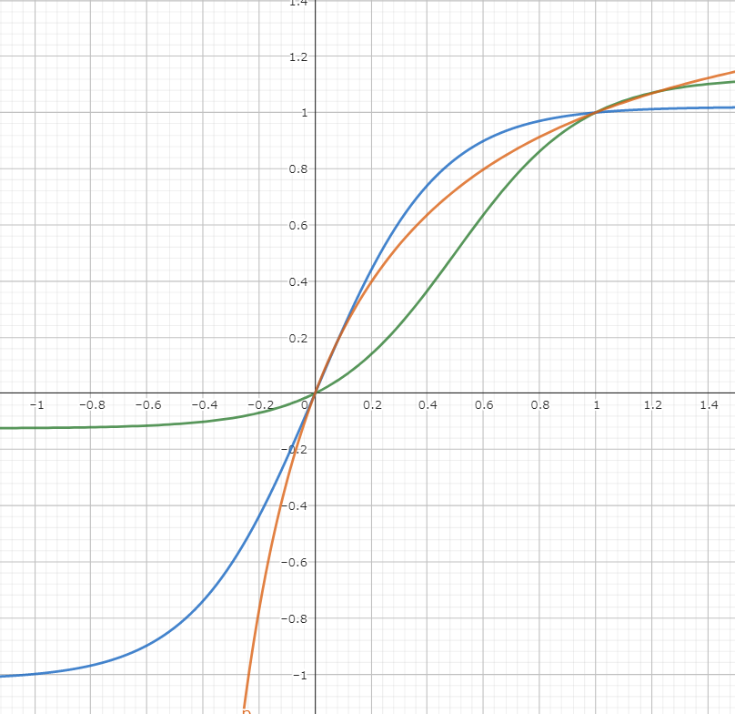

# Android 操作画面

## 1 はじめに

### 1.1 この文書について

2023/03/18に行われた四校技術交換会において、浦和高校の使用した技術の一部を公開、説明するものである。

## 2 目的

Bluetoothを使用して、ESP32またはAndroidをマスター、ESP32をスレーブとしてロボットを動作させる。

## 3 利用した技術

### 3.1 ハードウェア

- Android端末
- プログラム書き込みに必要なもの
  - PC
  - ケーブル
  - そのほか必要なもの

### 3.2 ソフトウェア

- Android Studio

### 3.3 プラグイン

- 'com.android.application' version '7.2.1'
- 'com.android.library' version '7.2.1'
- 'org.jetbrains.kotlin.android' version '1.6.20'

### 3.4 依存関係

- 'androidx.core:core-ktx:1.8.0'
- 'androidx.appcompat:appcompat:1.4.2'
- 'com.google.android.material:material:1.6.1'
- 'com.google.code.gson:gson:2.8.6'
- 'androidx.constraintlayout:constraintlayout:2.1.4'
- 'junit:junit:4.13.2'
    androidTestImplementation 'androidx.test.ext:junit:1.1.3'
- 'androidx.test.espresso:espresso-core:3.4.0'

## 4 手法

パネルに指で書くタイプとシークバーを操作する2タイプを作成する。

## 5 実装

### 5.1 ソースコード

めちゃくちゃ抜粋して一部を掲載する。
細かい実装はソースコードを参考に各々作ってほしい。

#### 5.1.1 MainActivity.kt

```kotlin
class MainActivity : AppCompatActivity(), OnTouchListener {
    lateinit var binding: ActivityMainBinding

    private var preDx = BigDecimal.ZERO
    private var preDy = BigDecimal.ZERO
    private var originX = BigDecimal.ZERO
    private var originY = BigDecimal.ZERO
    private var sqDistance = BigDecimal.ZERO
    private var displaySqSize40per = BigDecimal.ZERO
    private var topBarHeight = 0

    private var fixedOrigin = false
    private val maxValue = 255

    private val motorControl = MotorControl()

    private val seekBarListener = object : SeekBar.OnSeekBarChangeListener {
        override fun onProgressChanged(seekBar: SeekBar?, progress: Int, fromUser: Boolean) {
            val leftRight = when (seekBar?.id) {
                binding.seekBar1.id -> 0
                binding.seekBar2.id -> 1
                else -> throw Exception("This lister is must use for seekbar!")
            }
            if (leftRight == 0) {
                byteManager.setLeftMotorSpeed((abs(progress) * maxValue / 5).toUByte())
                byteManager.setLeftMotorDirection(progress < 0)
                val right = when (leftRight) {
                    0 -> binding.seekBar2
                    1 -> binding.seekBar1
                    else -> throw Exception("This lister is must use for seekbar!")
                }.progress
                byteManager.setRightMotorSpeed((abs(right) * maxValue / 5).toUByte())
                byteManager.setRightMotorDirection(right < 0)
            } else {
                byteManager.setRightMotorSpeed((abs(progress) * maxValue / 5).toUByte())
                byteManager.setRightMotorDirection(progress < 0)
                val left = when (leftRight) {
                    0 -> binding.seekBar2
                    1 -> binding.seekBar1
                    else -> throw Exception("This lister is must use for seekbar!")
                }.progress
                byteManager.setLeftMotorSpeed((abs(left) * maxValue / 5).toUByte())
                byteManager.setLeftMotorDirection(left < 0)
            }
            byteManager.setCheckDigits()
            val sendData = send()
            showLog("array", sendData)
        }

        override fun onStartTrackingTouch(seekBar: SeekBar?) {
            //TODO("Not yet implemented")
        }

        override fun onStopTrackingTouch(seekBar: SeekBar?) {
            seekBar?.progress = 0
            val leftRight = when (seekBar?.id) {
                binding.seekBar1.id -> 0
                binding.seekBar2.id -> 1
                else -> throw Exception("This lister is must use for seekbar!")
            }
            if (leftRight == 0) {
                byteManager.setLeftMotorSpeed(0u)
                byteManager.setLeftMotorDirection(false)
            }
            byteManager.setCheckDigits()
            val sendData = send()
            showLog("array", sendData, " end!")
        }
    }

    override fun onCreate(savedInstanceState: Bundle?) {
        binding.touchView.setOnTouchListener(this)
        binding.oSwitch.setOnCheckedChangeListener { _, isChecked ->
            fixedOrigin = isChecked
            binding.biasSelector.visibility = if (isChecked) {
                View.VISIBLE
            } else {
                View.INVISIBLE
            }
        }
        fixedOrigin = binding.oSwitch.isChecked
        binding.biasSelector.visibility = if (fixedOrigin) {
            View.VISIBLE
        } else {
            View.INVISIBLE
        }
        binding.biasSelector.check(binding.biasLinear.id)
        binding.controlSystemGroup.setOnCheckedChangeListener { _, _ -> selectControlSystem() }
        binding.controlSystemGroup.check(binding.panelControl.id)
        binding.seekBar1.setOnSeekBarChangeListener(seekBarListener)
        binding.seekBar2.setOnSeekBarChangeListener(seekBarListener)
    }

    override fun onWindowFocusChanged(hasFocus: Boolean) {
        super.onWindowFocusChanged(hasFocus)
        val dm = DisplayMetrics()
        @Suppress("DEPRECATION")
        windowManager.defaultDisplay.getRealMetrics(dm)
        val rect = Rect()
        window.decorView.getWindowVisibleDisplayFrame(rect)
        topBarHeight = (2 * dm.heightPixels - binding.mainActivity.height - rect.bottom) / 2
        val widthPow2 = BigDecimal(dm.widthPixels).pow(2)
        val heightPow2 = BigDecimal(dm.heightPixels).pow(2)
        displaySqSize40per = widthPow2.add(heightPow2).multiply(BigDecimal("0.4"))
    }

    override fun onTouch(v: View?, event: MotionEvent?): Boolean {
        val newDx =
            BigDecimal.valueOf(event?.rawX?.toDouble() ?: 0.0).setScale(3, RoundingMode.HALF_UP)
        val newDy =
            BigDecimal.valueOf(event?.rawY?.toDouble() ?: 0.0).setScale(3, RoundingMode.HALF_UP)
        if (originX == BigDecimal.ZERO) {
            originX = newDx
        }
        if (originY == BigDecimal.ZERO) {
            originY = newDy
        }
        when (event?.action) {
            MotionEvent.ACTION_DOWN -> {
                if (fixedOrigin) {
                    Log.i(
                        "x,y,statusBar",
                        "${originX.toInt()}, ${originY.toInt()}, $topBarHeight"
                    )
                    binding.originCircle.visibility = View.VISIBLE
                    binding.originCircle.layout(
                        originX.toInt() - binding.originCircle.width / 2,
                        originY.toInt() - topBarHeight - binding.originCircle.height / 2,
                        originX.toInt() + binding.originCircle.width / 2,
                        originY.toInt() - topBarHeight + binding.originCircle.height / 2
                    )
                }
            }
            MotionEvent.ACTION_MOVE -> {
                binding.touchView.visibility = View.INVISIBLE
                v?.performClick()
                val (dx, dy) = if (fixedOrigin) {
                    // 固定式原点
                    listOf(newDx.subtract(originX), newDy.subtract(originY).negate())
                } else {
                    // 移動式原点
                    // 左下スタートにする
                    listOf(newDx.subtract(preDx), newDy.subtract(preDy).negate())
                }
                val degree = BigDecimal.valueOf(atan2(dy.toDouble(), dx.toDouble()))
                    .multiply(BigDecimal(180))
                    .divide(BigDecimal(Math.PI.toString()), 10, RoundingMode.HALF_UP)
                Log.i(TAG, "x:$newDx, y:$newDy, dx:$dx, dy:$dy")
                Log.i(TAG, "radian:$degree")
                sqDistance = sqPythagoras(dx, dy, 3)
                val xy = motorControl.calcMotor(degree)
                val changedXY = xy.toMutableList()
                if (fixedOrigin) {
                    if (sqDistance < displaySqSize40per) {
                        for ((i, c) in changedXY.withIndex()) {
                            changedXY[i] = c.multiply(
                                sqDistance.divide(
                                    displaySqSize40per,
                                    10,
                                    RoundingMode.HALF_UP
                                ).sqrt(11)
                            )
                        }
                    }
                    fun changedXYBase(func: (BigDecimal) -> BigDecimal) {
                        for ((i, c) in changedXY.withIndex()) {
                            changedXY[i] = func(c.abs()).multiply(BigDecimal(xy[i].signum()))
                        }
                    }
                    when (binding.biasSelector.getCheckedRadioButtonId()) {
                        binding.biasSgmLn9.id -> changedXYBase(motorControl::sgmLn99)
                        binding.biasSgmLn199.id -> changedXYBase(motorControl::sgmLn199)
                        binding.biasLSgmLn99.id -> changedXYBase(motorControl::lSgmLn99)
                        binding.biasLSgmEP2.id -> changedXYBase(motorControl::lSgmEP2)
                        binding.biasFrac1.id -> changedXYBase(motorControl::rat1)
                        binding.biasFrac2.id -> changedXYBase(motorControl::rat2)
                        binding.biasFracE.id -> changedXYBase(motorControl::ratE)
                        binding.biasFrac4.id -> changedXYBase(motorControl::rat4)
                    }
                } else {
                    if (sqDistance < BigDecimal.TEN.pow(3)) {
                        for ((i, c) in changedXY.withIndex()) {
                            changedXY[i] = c.multiply(
                                sqDistance.divide(
                                    BigDecimal.TEN.pow(3),
                                    10,
                                    RoundingMode.HALF_UP
                                ).sqrt(10)
                            )
                        }
                    }
                }
                Log.i(TAG, "xy,$xy")
                Log.i(TAG, "sqDistance:$sqDistance")
                if (sqDistance > BigDecimal.ONE && sqDistance < BigDecimal.TEN.pow(3)
                        .multiply(BigDecimal(5))
                ) {
                    Log.i(TAG, "sqDistance:${sqDistance.sqrt()}")
                }
                byteManager.setLeftMotorSpeed((abs(changedXY[0].toInt()) * maxValue / 5).toUByte())
                byteManager.setLeftMotorDirection(changedXY[0].compareTo(BigDecimal.ZERO) == -1)
                byteManager.setRightMotorSpeed((abs(changedXY[1].toInt()) * maxValue / 5).toUByte())
                byteManager.setRightMotorDirection(changedXY[1].compareTo(BigDecimal.ZERO) == -1)
                Log.i(TAG, (changedXY[0] * BigDecimal(maxValue)).toInt().toString())
                byteManager.setCheckDigits()
                val sendData = send()
                showLog("array", sendData)
                Log.i(TAG, "==============================================")

                if (!fixedOrigin) {
                    preDx = newDx
                    preDy = newDy
                }
            }

            MotionEvent.ACTION_UP -> {
                binding.originCircle.visibility = View.INVISIBLE
                binding.touchView.visibility = View.VISIBLE
                preDx = BigDecimal.ZERO
                preDy = BigDecimal.ZERO
                originX = BigDecimal.ZERO
                originY = BigDecimal.ZERO
                if ((!fixedOrigin && sqDistance >= BigDecimal.TEN.pow(3)) || (fixedOrigin && sqDistance >= displaySqSize40per)) {
                    Log.i(TAG, "Flicked")
                } else {
                    byteManager.setLeftMotorSpeed(0u)
                    byteManager.setRightMotorDirection(false)
                    byteManager.setRightMotorSpeed(0u)
                    byteManager.setRightMotorDirection(false)
                    send()
                }
                Log.i(TAG, "Release")
            }
        }
        return true
    }
}
```

### 5.2 解説

#### 5.2.1 seekBarListener

シークバーによる操作を行うときの動作。たぶん前5段階後ろ5段階だったはず。
送信までやる。
指を離すと停止する。

#### 5.2.2 onCreate

もろもろ初期化してる

#### 5.2.3 onWindowFocusChanged

なにこれ

#### 5.2.4 onTouch

指でパネルを操作する。

- 指を置いた場所を原点として、方向と距離を方向と速度にする。
- 直前に取得した点を原点として、方向と距離を方向と速度にする。

- 前者はゲームパッド
- 後者はロボットが指に追随するような動き

のようになる

画面は小さいので、操作距離にバイアスをかけてある。

  
緑:sgm系
青:lSgm系
橙:rat系
