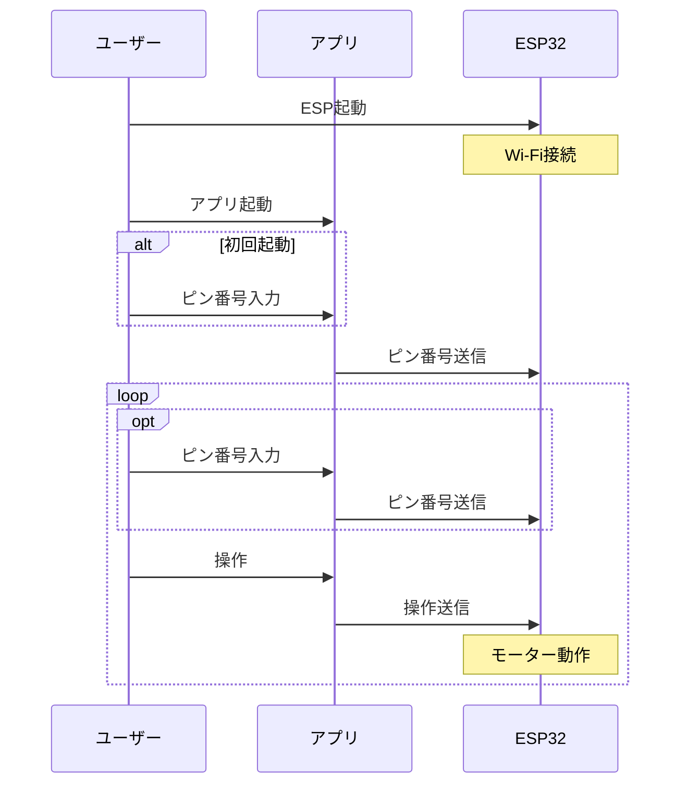

# ユーザー-アプリ-esp32

```mermaid
sequenceDiagram
participant user as ユーザー
participant app as アプリ
participant esp32 as ESP32
    user->>esp32: ESP起動
    Note over esp32: Wi-Fi接続
    user->>app: アプリ起動
    alt 初回起動
        user->>app: ピン番号入力
    end
    app->>esp32: ピン番号送信
    loop
        opt
            user->>app: ピン番号入力
            app->>esp32: ピン番号送信
        end
        user->>app: 操作
        app->>esp32: 操作送信
        Note over esp32: モーター動作
    end
```
